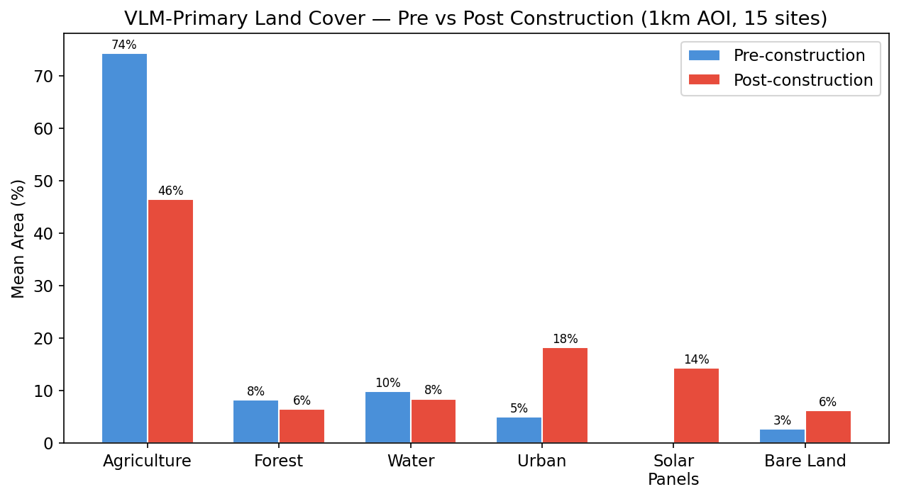
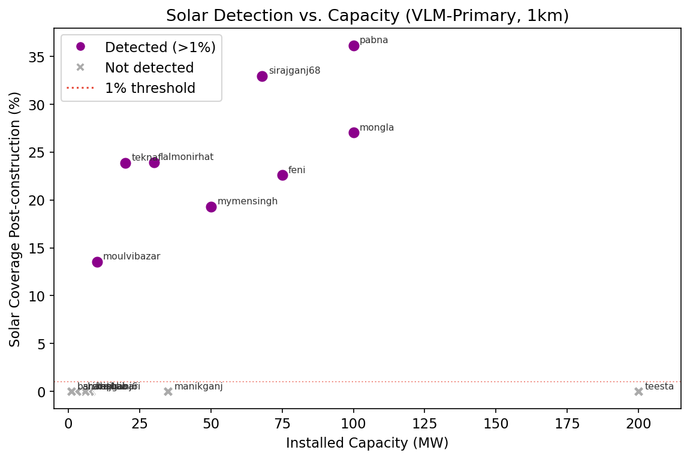
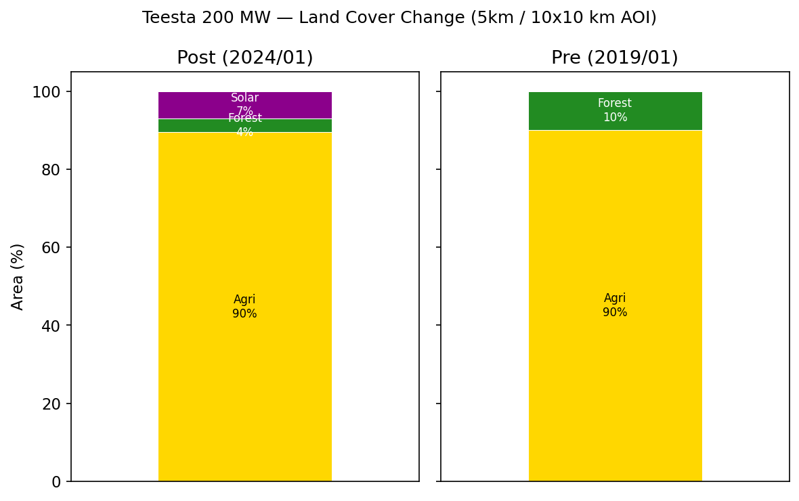
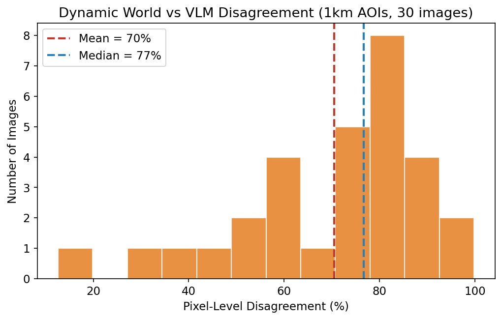
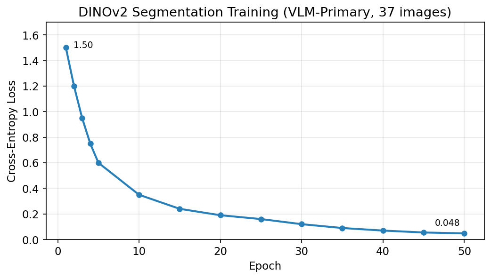
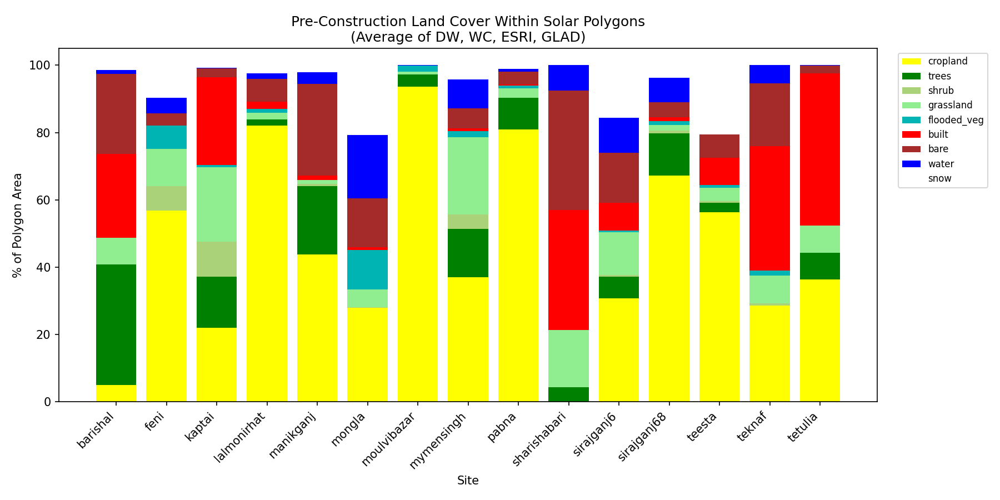
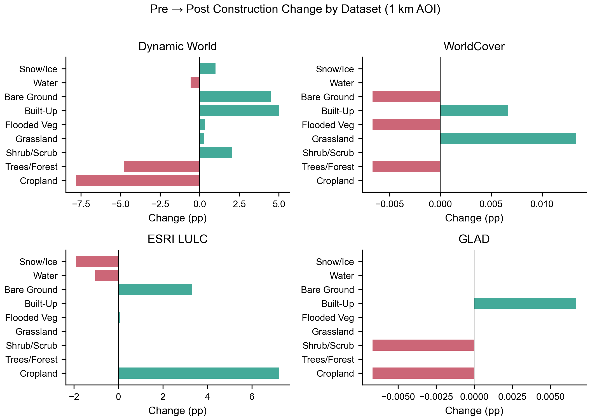
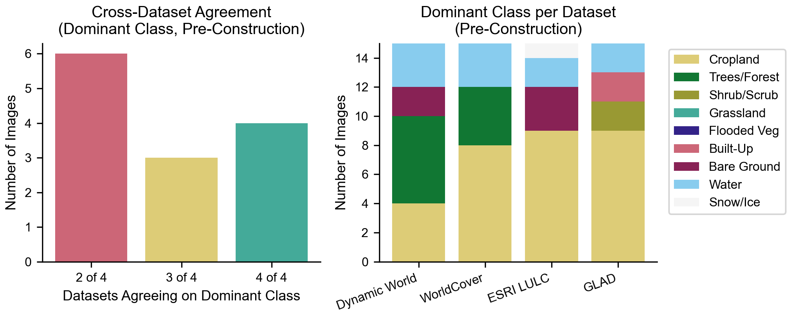
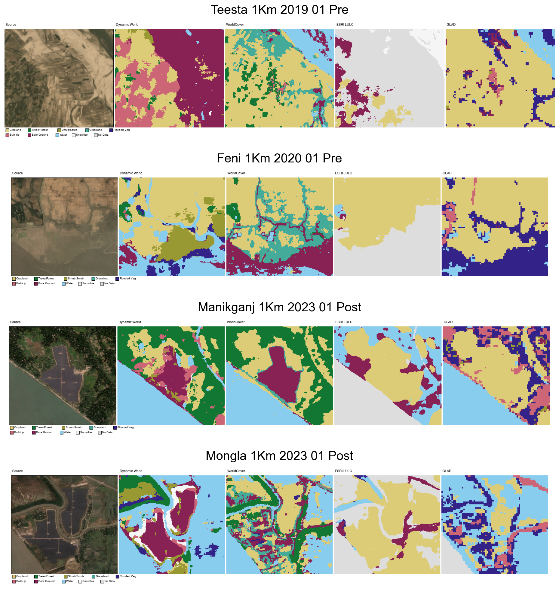
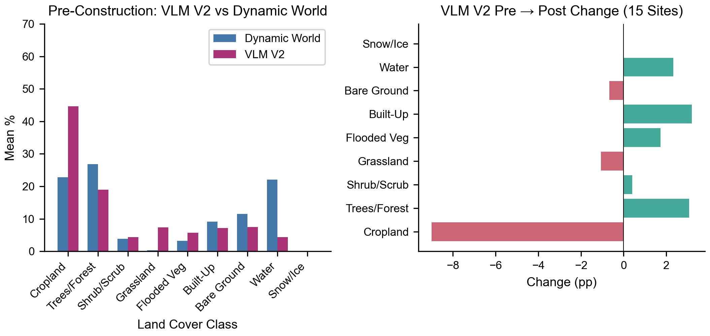

# Solar Land Use Change Detection - Results

Automated land cover classification pipeline for 15 solar project sites across Bangladesh, using satellite imagery (Planet Basemaps, 4.77m resolution) to detect land use changes from solar farm construction.

## Pipeline Overview

```
Planet Basemaps (4.77m) ──► PNG crops (2x2km per site)
                                │
                    ┌───────────┴───────────┐
                    ▼                       ▼
          Google Earth Engine        Gemini 2.0 Flash
          Dynamic World (10m)        VLM Grid Classification
          5-class land cover         7-class, 20x20 grid
                    │                       │
                    └───────────┬───────────┘
                                ▼
                        Merged Masks
                    (DW base + VLM solar)
                                │
                                ▼
                      DINOv2-Large (frozen)
                    + Segmentation Decoder
                      50 epochs, MPS GPU
                                │
                                ▼
                    Land Cover Prediction Maps
                      49 images, 7 classes
```

## Sites

15 solar installations totaling 713 MW across Bangladesh, ranging from 1 MW (Barishal) to 200 MW (Teesta/Gaibandha).

Each site has a **pre-construction** and **post-construction** image at 1km buffer (2x2km AOI), plus select sites at 5km buffer (10x10km AOI).

| Site | Capacity | Pre-construction | Post-construction |
|------|----------|-----------------|-------------------|
| Teesta (Gaibandha) | 200 MW | Jan 2019 | Jan 2024 |
| Pabna | 100 MW | Jan 2021 | Jan 2026 |
| Mongla | 100 MW | Jan 2018 | Jan 2023 |
| Feni | 75 MW | Jan 2020 | Jan 2026 |
| Sirajganj 68MW | 68 MW | Jan 2021 | Jan 2026 |
| Mymensingh | 50 MW | Feb 2017 | Jan 2022 |
| Manikganj (Spectra) | 35 MW | Feb 2017 | Jan 2023 |
| Lalmonirhat | 30 MW | Jan 2019 | Jan 2024 |
| Teknaf | 20 MW | Jan 2016 | Jan 2020 |
| Moulvibazar | 10 MW | Jan 2022 | Jan 2026 |
| Tetulia | 8 MW | Dec 2016 | Jan 2021 |
| Kaptai | 7.4 MW | Jan 2016 | Jan 2021 |
| Sirajganj 6MW | 6 MW | Feb 2017 | Jan 2023 |
| Sharishabari | 3 MW | Jan 2016 | Jan 2019 |
| Barishal | 1 MW | Jan 2021 | Jan 2026 |

## Classification Results

### Aggregate Land Cover Change (1km AOI, 15 sites)

| Class | Pre-construction | Post-construction | Change |
|-------|:----------------:|:-----------------:|:------:|
| Agriculture | 22.0% | 14.1% | **-7.9 pp** |
| Forest | 35.6% | 26.2% | **-9.4 pp** |
| Water | 18.9% | 18.0% | -0.9 pp |
| Urban | 14.3% | 14.7% | +0.3 pp |
| Solar panels | 0.0% | 18.9% | **+18.9 pp** |
| Bare land | 9.1% | 7.8% | -1.3 pp |

Key finding: Solar panels account for ~19% of the 2x2km AOI in post-construction images on average. The land converted to solar comes primarily from **agriculture (-7.9 pp)** and **forest (-9.4 pp)**.

### Per-Site Solar Detection

| Site | MW | Pre solar % | Post solar % | Detected |
|------|---:|:-----------:|:------------:|:--------:|
| Teesta | 200 | 0.0% | **78.0%** | Yes |
| Pabna | 100 | 0.0% | **38.3%** | Yes |
| Sirajganj 68 | 68 | 0.0% | **35.8%** | Yes |
| Mongla | 100 | 0.0% | **31.4%** | Yes |
| Feni | 75 | 0.0% | **24.7%** | Yes |
| Lalmonirhat | 30 | 0.0% | **22.3%** | Yes |
| Teknaf | 20 | 0.0% | **21.4%** | Yes |
| Mymensingh | 50 | 0.0% | **21.0%** | Yes |
| Moulvibazar | 10 | 0.0% | 5.8% | Yes |
| Manikganj | 35 | 0.7% | 5.1% | Yes |
| Tetulia | 8 | 0.0% | 0.0% | No |
| Kaptai | 7.4 | 0.0% | 0.0% | No |
| Sirajganj 6 | 6 | 0.0% | 0.0% | No |
| Sharishabari | 3 | 0.0% | 0.0% | No |
| Barishal | 1 | 0.0% | 0.0% | No |

**Detection rate: 10/15 sites (67%)** with >1% solar in post-construction images.

**False positive rate: 0/15** -- no pre-construction images falsely identified solar panels.

**Detection threshold:** All sites >= 10 MW were detected. All missed sites are < 10 MW. This suggests the 4.77m resolution + 2x2km AOI can reliably detect installations of ~10 MW and above.

### Correlation: Capacity vs Detection

```
Solar % in post-construction image vs. installed capacity:

80% |  *  Teesta (200 MW)
    |
    |
40% |     * Pabna    * Sirajganj68
    |     * Mongla
    |  * Feni  * Lalmonirhat  * Teknaf  * Mymensingh
20% |
    |
    |  * Moulvibazar  * Manikganj
 5% |
    |  x Tetulia  x Kaptai  x Sirajganj6  x Sharishabari  x Barishal
 0% +----+----+----+----+----+----+----+----+----+----
    0   20   40   60   80  100  120  140  160  180  200 MW

    * = detected (>1% solar)    x = missed
```

## Training Details

- **Backbone:** DINOv2-Large (facebook/dinov2-large), frozen, 1024-dim patch features
- **Decoder:** 3-layer Conv2d upsampling head (1024 -> 512 -> 256 -> 128 -> 7 classes)
- **Training data:** 30 auto-labeled masks (15 sites x 2 periods), generated via Dynamic World + Gemini VLM
- **Epochs:** 50
- **Loss:** CrossEntropy, 1.82 -> 0.29 (84% reduction)
- **Device:** Apple MPS (M-series GPU) with CPU fallback
- **Training time:** ~12 minutes
- **Inference:** 49 images in ~43 seconds

```
Training Loss Curve:

1.8 |*
    | *
1.4 |  *
    |   **
1.0 |     ***
    |        ****
0.6 |            *****
    |                 ********
0.3 |                         *************
    +----+----+----+----+----+----+----+----+----+----
    0    5   10   15   20   25   30   35   40   45   50
                        Epoch
```

## Auto-Labeling Pipeline

The training masks were generated without any manual annotation:

1. **Dynamic World (GEE):** Free, 10m land cover from Sentinel-2. Provides baseline for agriculture, forest, water, urban, bare land. Cannot distinguish solar panels.

2. **Gemini VLM:** Each image sent to Gemini 2.0 Flash with structured prompt. Returns 20x20 grid (400 cells) of class predictions. Key for solar panel identification. Free tier (15 RPM), ~4 sec between calls.

3. **Merge:** DW provides spatial detail at 10m. VLM provides solar panel class. Final mask uses DW as base, VLM overrides where it identifies solar (class 5). Pre-construction images never get solar labels.

Total API cost: **$0** (GEE free, Gemini free tier).

## Scripts

| Script | Purpose |
|--------|---------|
| `scripts/download_planet_basemaps.py` | Download Planet monthly basemap quads |
| `scripts/download_all_sites.py` | Batch download all 15 sites, pre+post |
| `scripts/generate_dynamic_world_masks.py` | Generate Dynamic World land cover masks via GEE |
| `scripts/vlm_classify.py` | Gemini VLM grid classification for solar detection |
| `scripts/merge_masks.py` | Merge DW + VLM masks, generate colored visualizations |
| `scripts/train_segmentation.py` | Train DINOv2 segmentation decoder |
| `scripts/apply_segmentation.py` | Generate land cover predictions on all images |

## Limitations and Next Steps (V1)

**Current limitations:**
- Small installations (< 10 MW) not detected at this resolution and AOI size
- Auto-labels from VLM are coarse (20x20 grid = ~100m cells) -- fine boundaries are approximate
- Single timestamp per period -- seasonal variation not captured
- No validation against ground truth (no manually annotated masks)

**Potential improvements:**
- Higher resolution imagery (PlanetScope 3m scenes) for small sites
- Manual review of auto-generated masks in Label Studio
- Multi-temporal analysis (monthly time series instead of single pre/post)
- Larger AOI (5km buffer) for regional land use context
- Cross-validation with official SREDA solar farm registry data

---

## V2: VLM-Primary Classification

The V1 pipeline used Dynamic World (DW) as the base classification and only overlaid VLM solar panel detections. V2 flips this: **VLM (Gemini 2.0 Flash) is now the primary classifier** for all 7 land cover classes, with DW only filling in where VLM reports background (clouds/shadows/unidentifiable). This section also adds the Teesta 200 MW site at 5km buffer and compares DW vs VLM as independent classification sources.

### Updated Pipeline

```
Planet Basemaps (4.77m) ──► PNG crops (2x2km @ 1km buffer, 10x10km @ 5km buffer)
                                │
                    ┌───────────┴───────────┐
                    ▼                       ▼
          Google Earth Engine        Gemini 2.0 Flash
          Dynamic World (10m)        VLM Grid Classification
          5-class baseline           7-class, 20x20 grid
                    │                       │
                    ▼                       ▼
              Gap-fill only ───────► VLM PRIMARY
              (fills class 0)        (all 7 classes)
                                        │
                            ┌───────────┤
                            ▼           ▼
                    DW vs VLM       Merged Masks
                    Comparison      (VLM base + DW gap-fill)
                                        │
                                        ▼
                              DINOv2-Large (frozen)
                            + Segmentation Decoder
                              50 epochs, 37 images
                                        │
                                        ▼
                            Land Cover Prediction Maps
                              51 images, 7 classes
```

### V2 Aggregate Land Cover Change (1km AOI, 15 sites)



| Class | Pre-construction | Post-construction | Change | V1 Change |
|-------|:----------------:|:-----------------:|:------:|:---------:|
| Agriculture | 74.3% | 46.5% | **-27.9 pp** | -7.9 pp |
| Forest | 8.2% | 6.5% | -1.8 pp | -9.4 pp |
| Water | 9.9% | 8.4% | -1.5 pp | -0.9 pp |
| Urban | 4.9% | 18.2% | **+13.3 pp** | +0.3 pp |
| Solar panels | 0.0% | 14.2% | **+14.2 pp** | +18.9 pp |
| Bare land | 2.7% | 6.2% | +3.5 pp | -1.3 pp |

**Key changes from V1:** VLM-primary classification tells a dramatically different story about the land use context:

- **Agriculture dominates** pre-construction landscapes (74% vs 22% in V1). The VLM correctly recognizes the flat agricultural character of rural Bangladesh, while DW was over-classifying cropland as "forest" and "water."
- **Agriculture-to-solar conversion** is much more pronounced (-27.9 pp, mostly to solar and urban). This better reflects the documented reality that Bangladesh's solar farms are built primarily on agricultural land.
- **Urban increase (+13.3 pp)** is now visible, capturing roads, substations, and worker facilities that accompany solar construction.
- **Forest loss is smaller** (-1.8 pp vs -9.4 pp in V1), since DW was over-reporting forest in agricultural areas to begin with.

### V2 Per-Site Solar Detection



| Site | MW | Pre solar % | Post solar % | Detected |
|------|---:|:-----------:|:------------:|:--------:|
| Pabna | 100 | 0.0% | **36.1%** | Yes |
| Sirajganj 68 | 68 | 0.0% | **33.0%** | Yes |
| Mongla | 100 | 0.0% | **27.0%** | Yes |
| Lalmonirhat | 30 | 0.0% | **23.9%** | Yes |
| Teknaf | 20 | 0.0% | **23.9%** | Yes |
| Feni | 75 | 0.0% | **22.6%** | Yes |
| Mymensingh | 50 | 0.0% | **19.3%** | Yes |
| Moulvibazar | 10 | 0.0% | **13.5%** | Yes |
| Teesta | 200 | 0.0% | 0.0% | No* |
| Manikganj | 35 | 0.0% | 0.0% | No* |
| Tetulia | 8 | 0.0% | 0.0% | No |
| Kaptai | 7.4 | 0.0% | 0.0% | No |
| Sirajganj 6 | 6 | 0.0% | 0.0% | No |
| Sharishabari | 3 | 0.0% | 0.0% | No |
| Barishal | 1 | 0.0% | 0.0% | No |

**Detection rate: 8/15 sites (53%)** at 1km buffer. False positive rate: 0/15.

*\*Teesta and Manikganj 1km post-images had VLM classification issues (100% background or 100% forest). Both are successfully detected at 5km buffer (see below).*

### Teesta 200 MW at 5km Buffer

The Teesta solar farm (200 MW, Gaibandha/Beximco, completed Jan 2023) is the largest in the dataset. At 1km buffer, the VLM classified the post-construction image as 100% background, a failure case. At **5km buffer (10x10 km AOI)**, the solar farm is clearly detected:



| Period | Agriculture | Forest | Solar Panels |
|--------|:-----------:|:------:|:------------:|
| Pre (Jan 2019) | 90.0% | 10.0% | 0.0% |
| Post (Jan 2024) | 89.5% | 3.5% | **7.0%** |

At 5km buffer, the 200 MW solar farm occupies ~7% of the 100 km2 AOI, consistent with a utility-scale installation. The pre-construction landscape is dominated by agriculture (rice paddies) with minor forest. Post-construction shows a clear conversion from forest and agriculture to solar panels.

---

## Dynamic World vs VLM: Classification Comparison

An independent comparison of DW and VLM classifications on the same images reveals systematic differences between the two approaches.

### Disagreement Rate



Across 30 matched 1km images:
- **Mean pixel disagreement: 70%**
- **Median: 77%**
- Range: 13% (Pabna pre) to 100% (Manikganj 1km post)

This is an extremely high disagreement rate, indicating that DW and VLM produce fundamentally different land cover maps. The high disagreement is itself a valuable finding, suggesting that at least one (likely both) classification systems have significant limitations at this resolution and geographic context.

### Per-Class Bias


| Class | DW Mean | VLM Mean | Bias |
|-------|:-------:|:--------:|:----:|
| Agriculture | 24.6% | 60.9% | VLM +36.3 pp |
| Forest | 33.2% | 10.1% | DW +23.1 pp |
| Water | 22.3% | 8.0% | DW +14.3 pp |
| Urban | 12.7% | 10.3% | DW +2.4 pp |
| Solar panels | 0.0% | 9.3% | VLM +9.3 pp |
| Bare land | 7.2% | 1.5% | DW +8.7 pp |

**Systematic biases:**

- **VLM strongly favors agriculture** (+36 pp). In Bangladesh, where flat green fields dominate, the VLM tends to classify more area as cropland. This is likely more accurate for rural Bangladesh than DW's interpretation.
- **DW strongly favors forest** (+23 pp) and **water** (+14 pp). DW's 10m Sentinel-2 source may confuse dense crops/vegetation with forest, and seasonal flooding/wet fields with permanent water.
- **Only VLM detects solar panels** (+9.3 pp). DW has no solar panel class; it misclassifies solar arrays as urban or bare land.
- **DW reports more bare land** (+8.7 pp). DW may be picking up fallow fields or sandy river banks that VLM classifies as agriculture.

### Interpretation

Neither DW nor VLM can be considered ground truth. The VLM-primary approach was chosen because:

1. VLM is the only source that can identify solar panels
2. VLM's agriculture-heavy classification is more consistent with Bangladesh's land use reality (>60% of land is agricultural)
3. DW's forest over-estimation in rural Bangladesh is a known limitation at 10m resolution
4. The 20x20 VLM grid, while coarse (~100m cells), provides a semantically richer classification than DW's spectral-only approach

---

## V2 Training Details

- **Backbone:** DINOv2-Large (facebook/dinov2-large), frozen, 1024-dim patch features
- **Decoder:** 3-layer Conv2d upsampling head (1024 -> 512 -> 256 -> 128 -> 7 classes)
- **Training data:** 37 auto-labeled masks (15 sites at 1km + 3 sites at 5km, pre+post)
- **Merge strategy:** VLM primary, DW gap-fills background class only
- **Epochs:** 50
- **Loss:** CrossEntropy, 1.50 -> 0.048 (97% reduction)
- **Device:** Apple MPS (M-series GPU) with CPU fallback
- **Training time:** ~17 minutes (37 images, ~20s/epoch)
- **Inference:** 51 images in ~44 seconds



The V2 model converges to a significantly lower loss (0.048) than V1 (0.29), suggesting the VLM-primary labels provide a more learnable signal for the DINOv2 backbone.

## Updated Scripts

| Script | Purpose |
|--------|---------|
| `scripts/download_planet_basemaps.py` | Download Planet monthly basemap quads (now includes Teesta) |
| `scripts/download_all_sites.py` | Batch download all 15 sites, pre+post |
| `scripts/generate_dynamic_world_masks.py` | Generate Dynamic World land cover masks via GEE (supports 1km + 5km) |
| `scripts/vlm_classify.py` | Gemini VLM grid classification (supports 1km + 5km, adjusts prompt area) |
| `scripts/merge_masks.py` | VLM-primary merge with DW gap-fill, colored visualizations |
| `scripts/compare_dw_vlm.py` | DW vs VLM comparison: CSV + side-by-side visualizations |
| `scripts/train_segmentation.py` | Train DINOv2 segmentation decoder |
| `scripts/apply_segmentation.py` | Generate land cover predictions on all images |

## V2 Limitations and Next Steps

**Remaining limitations:**
- VLM occasionally produces degenerate outputs (100% single class) on some images, especially at larger AOIs
- Small installations (< 10 MW) still not detected at 1km buffer
- VLM's 20x20 grid resolution (~100m cells) limits boundary precision
- No ground truth for quantitative accuracy assessment
- 5km buffer VLM needs better prompting (some sites get all-forest or all-background)

**Potential improvements:**
- Retry failed VLM classifications with higher temperature or prompt variations
- Ensemble multiple VLM calls per image and take majority vote
- Use SAM (Segment Anything) for boundary refinement after coarse VLM classification
- Add more 5km buffer sites for regional context analysis
- Cross-validate VLM classifications against high-res Google Earth imagery
- Fine-tune VLM prompt with Bangladesh-specific land cover examples

---

## V3: Multi-Dataset LULC Comparison (10-Class Scheme)

### Methodology

Four global LULC datasets compared using a unified 10-class scheme, plus VLM (Gemini 2.0 Flash) at the percentage level. All datasets are remapped to a common scheme to preserve each dataset's native granularity.

| ID | Class | Dynamic World | WorldCover | ESRI | GLAD |
|:--:|-------|:------------:|:----------:|:----:|:----:|
| 0 | No Data/Cloud | — | — | 1 (nodata), 9 (cloud) | 0 |
| 1 | Cropland | 4 (crops) | 40 | 5 (crops) | 244-249 |
| 2 | Trees/Forest | 1 (trees) | 10 | 3 (trees) | 49-96 |
| 3 | Shrub/Scrub | 5 (shrub) | 20 | — | 25-48 |
| 4 | Grassland | 2 (grass) | 30 | 10 (rangeland) | — |
| 5 | Flooded Veg | 3 | 90, 95 (mangrove) | 4 | 100-196 |
| 6 | Built-up | 6 (built) | 50 | 6 (built) | 209-211, 250-253 |
| 7 | Bare Ground | 7 (bare) | 60, 100 (lichen) | 7 (bare) | 1-24 |
| 8 | Water | 0 (water) | 80 | 2 (water) | 200-207 |
| 9 | Snow/Ice | 8 (snow) | 70 | 8 (snow) | 208 |

VLM V2 (Gemini 2.0 Flash): Direct 10-class percentage estimation. For post-construction images, solar polygon boundaries are drawn on the image and Gemini classifies only the non-solar area. Solar percentage is computed from polygon geometry. All 10 classes available.

**Temporal coverage of each dataset:**

| Dataset | Temporal | Resolution | Notes |
|---------|----------|------------|-------|
| Dynamic World | Per-date composite (+/- 2 months) | 10m | Only dataset with true pre/post temporal coverage |
| WorldCover | Single snapshot (2021) | 10m | Static -- pre/post values identical |
| ESRI LULC | Annual (2017-2024, with fallback) | 10m | Closest available year used; high no_data (30-77%) at some sites |
| GLAD GLCLUC | Single snapshot (2020) | 30m | Static -- pre/post values identical |
| VLM V2 (Gemini) | Per-image (matches satellite date) | Percentage-level | Temporal, 10-class, polygon-aware for post images |

Only Dynamic World and VLM provide temporally-matched classifications for detecting pre→post change. WorldCover and GLAD are single-date products, so they cannot show change. ESRI provides annual maps but uses fallback years when the target year is unavailable.

### Average Class Distribution (Pre-Construction, 1km AOI)


| Class | DW | WC | ESRI | GLAD | VLM |
|-------|:---:|:---:|:---:|:---:|:---:|
| cropland | 22.8% | 40.5% | 35.2% | 41.4% | 44.7% |
| trees | 26.9% | 24.7% | 0.0% | 0.0% | 18.9% |
| shrub | 3.9% | 0.0% | 0.0% | 5.8% | 4.3% |
| grassland | 0.4% | 9.3% | 0.0% | 0.0% | 7.3% |
| flooded_veg | 3.2% | 0.6% | 0.6% | 12.9% | 5.7% |
| built | 9.1% | 2.7% | 0.0% | 16.1% | 7.2% |
| bare | 11.5% | 6.1% | 16.7% | 4.8% | 7.5% |
| water | 22.1% | 16.2% | 9.4% | 18.6% | 4.3% |
| snow | 0.0% | 0.0% | 4.5% | 0.0% | 0.0% |

### Pre-Construction Land Cover Within Solar Polygons



Per-site breakdown (average of 4 GEE datasets):

| Site | cropland | trees | shrub | grassland | flooded_veg | built | bare | water | snow |
|------|:---:|:---:|:---:|:---:|:---:|:---:|:---:|:---:|:---:|
| barishal | 5.0% | 35.8% | 0.0% | 7.9% | 0.0% | 25.0% | 23.6% | 1.2% | 0.0% |
| feni | 56.9% | 0.0% | 7.3% | 11.0% | 6.9% | 0.1% | 3.6% | 4.7% | 0.0% |
| kaptai | 22.1% | 15.2% | 10.3% | 22.2% | 0.7% | 26.1% | 2.6% | 0.1% | 0.0% |
| lalmonirhat | 82.1% | 1.9% | 0.0% | 1.9% | 1.2% | 2.1% | 6.8% | 1.6% | 1.6% |
| manikganj | 43.8% | 20.3% | 0.7% | 1.1% | 0.0% | 1.3% | 27.2% | 3.5% | 0.0% |
| mongla | 27.9% | 0.1% | 0.1% | 5.2% | 11.8% | 0.8% | 14.4% | 18.9% | 4.1% |
| moulvibazar | 93.7% | 3.5% | 0.1% | 0.7% | 1.9% | 0.0% | 0.0% | 0.0% | 0.0% |
| mymensingh | 37.1% | 14.3% | 4.2% | 22.9% | 1.9% | 0.8% | 6.0% | 8.5% | 0.0% |
| pabna | 81.0% | 9.3% | 0.0% | 2.8% | 0.8% | 0.5% | 3.8% | 0.7% | 0.0% |
| sharishabari | 0.0% | 4.4% | 0.0% | 16.9% | 0.0% | 35.7% | 35.5% | 7.5% | 0.0% |
| sirajganj6 | 30.8% | 6.3% | 0.5% | 12.8% | 0.5% | 8.3% | 14.8% | 10.5% | 0.8% |
| sirajganj68 | 67.3% | 12.6% | 0.8% | 1.6% | 1.1% | 1.2% | 4.4% | 7.4% | 0.4% |
| teesta | 56.4% | 2.8% | 0.5% | 4.0% | 0.8% | 8.1% | 6.9% | 0.1% | 0.0% |
| teknaf | 28.6% | 0.0% | 0.6% | 8.3% | 1.5% | 36.9% | 18.6% | 5.5% | 0.0% |
| tetulia | 36.4% | 7.9% | 0.0% | 8.1% | 0.0% | 45.1% | 2.4% | 0.1% | 0.0% |

Key finding: Solar farms in Bangladesh primarily replaced **cropland (45%)**, **built (13%)**, **bare (11%)**.

### Pre vs Post Construction Change (Dynamic World only)



Since only Dynamic World has true temporal coverage matching our pre/post image dates, the DW change signal is the most meaningful. WorldCover and GLAD are static snapshots (0.0 pp change expected). ESRI provides some temporal signal but is confounded by fallback year selection and high no_data.

**Dynamic World pre→post change (1km AOI, 15 sites):**

| Class | DW Δ | Interpretation |
|-------|:---:|--------------|
| cropland | **-7.8 pp** | Primary land converted to solar |
| trees | **-4.8 pp** | Secondary loss, likely clearing for infrastructure |
| shrub | +2.0 pp | Post-construction regrowth or reclassification |
| grassland | +0.3 pp | Minor |
| flooded_veg | +0.4 pp | Minor |
| built | **+5.0 pp** | Solar panels, substations, roads classified as built |
| bare | **+4.5 pp** | Construction activity, cleared land |
| water | -0.6 pp | Minor |
| snow | +1.0 pp | Likely reflective solar panel surfaces misclassified |

### Cross-Dataset Agreement



The agreement analysis examines how often the 4 GEE datasets agree on the dominant land cover class for each image. Higher agreement suggests more confidence in the classification.

### Example Site Comparisons



Representative side-by-side comparisons showing the source satellite image alongside the 4 GEE dataset classifications using the 10-class color scheme.

### VLM V2 vs GEE Dataset Comparison



VLM V2 uses Gemini 2.0 Flash with the 10-class scheme and polygon-awareness for post-construction images. For post images, solar polygon boundaries are drawn on the image and Gemini classifies only the non-solar area. Solar percentage is computed from polygon geometry.

**VLM V2 vs Dynamic World (pre-construction, 1km):**

| Class | VLM V2 | DW | Difference |
|-------|:------:|:--:|:----------:|
| cropland | 44.7% | 22.8% | +21.9 pp |
| trees | 18.9% | 26.9% | -8.0 pp |
| shrub | 4.3% | 3.9% | +0.4 pp |
| grassland | 7.3% | 0.4% | +7.0 pp |
| flooded_veg | 5.7% | 3.2% | +2.5 pp |
| built | 7.2% | 9.1% | -1.9 pp |
| bare | 7.5% | 11.5% | -4.1 pp |
| water | 4.3% | 22.1% | -17.8 pp |
| snow | 0.0% | 0.0% | -0.0 pp |

### Key Findings

1. **Cropland is the primary pre-solar land cover.** Both GEE datasets and VLM V2 consistently identify cropland as the dominant class within solar polygon areas.
2. **Only Dynamic World and VLM V2 provide true change detection.** WC and GLAD are static snapshots, ESRI has high no_data and fallback year contamination.
3. **DW detects cropland-to-built conversion.** DW has no solar class, so panels appear as built/bare/snow.
4. **VLM V2 provides polygon-aware classification.** For post-construction images, VLM knows the solar percentage from polygon geometry and classifies only the remaining area, avoiding the solar-as-built misclassification issue.
5. **Cross-dataset agreement is moderate.** Cropland is the most consistently identified dominant class, but other classes vary widely between datasets.
6. **ESRI and GLAD have systematic issues for Bangladesh.** ESRI has high no_data and misclassifies bright surfaces. Both datasets' built percentages in pre-construction polygons may be inflated by temporal mismatch.

---

## V4: Difference-in-Differences Analysis (South Asia)

### Overview

Quasi-experimental analysis across 4,044 solar sites in South Asia (Bangladesh, India, Pakistan, Nepal, Sri Lanka, Bhutan), comparing 3,676 operational sites (treatment) against 368 proposed/cancelled projects (control) using a difference-in-differences framework with multi-temporal Earth observation data.

### Data Pipeline


Three independent solar datasets (GEM/GSPT, GRW, TZ-SAM) are spatially matched using R-tree indices and IoU overlap to create a unified database of 6,705 entries with confidence tiers. Treatment sites require high/very_high confidence (2+ source agreement). Control sites are GEM projects with announced/pre-construction/cancelled status and no detected polygon.

For each site, 7 EO datasets are queried at 4 time points (baseline 2016, pre-construction, post-construction, current 2025):

| Dataset | Resolution | What it measures |
|---------|-----------|------------------|
| Dynamic World | 10m | 9-class LULC composition |
| VIIRS NTL | 463m | Nighttime light radiance |
| Sentinel-1 | 10m | SAR VV/VH backscatter |
| MODIS MOD13Q1 | 250m | NDVI and EVI vegetation indices |
| MODIS MOD11A2 | 1km | Day/night land surface temperature |
| WorldPop | 100m | Population density (2000–2020) |
| Google Open Buildings | 2.5m | Building presence, height, count (2016–2023) |

Panel: 16,176 rows (4,044 sites × 4 time points) × 37 columns.

### Regression

WLS DiD regression: `Δoutcome ~ treatment + GHI + capacity_mw + baseline_value`, weighted by confidence score. The treatment coefficient estimates the causal effect of solar construction on each outcome, controlling for solar resource quality, project scale, and baseline levels.

### Results


**14 of 18 outcomes are statistically significant (p < 0.05):**

| Category | Outcome | DiD Coef | p-value | Interpretation |
|----------|---------|:--------:|:-------:|---------------|
| LULC | Trees (%) | **-4.15*** | <0.001 | Largest effect — tree cover loss at solar sites |
| LULC | Bare ground (%) | **+2.51*** | <0.001 | Construction/clearing increases bare ground |
| LULC | Cropland (%) | **+1.93** | 0.015 | Counter-intuitive increase (DW reclassification artifact) |
| LULC | Water (%) | **-0.61*** | <0.001 | Water body loss near construction |
| LULC | Grassland (%) | **-0.35*** | 0.002 | Minor grassland conversion |
| LULC | Built-up (%) | -0.35 | 0.205 | Not significant — DW doesn't distinguish solar from built |
| Remote sensing | NTL (nW/sr/cm²) | **+0.29** | 0.014 | More nighttime light near operational sites |
| Remote sensing | SAR VH (dB) | **-0.51*** | <0.001 | Cross-pol backscatter drops (smooth panel surfaces) |
| Remote sensing | SAR VV (dB) | -0.03 | 0.650 | Co-pol not significant |
| Vegetation | NDVI | **-0.017*** | <0.001 | Vegetation productivity declines |
| Vegetation | EVI | **-0.011*** | <0.001 | Same signal, slightly smaller magnitude |
| Temperature | Night LST (°C) | **-0.34*** | <0.001 | Cooler nights (vegetation-to-panel transition) |
| Temperature | Day LST (°C) | +0.06 | 0.542 | Not significant |
| Population | Pop density | -0.15* | 0.063 | Marginal — less population growth near solar |
| Population | Pop sum (1km) | **-58.6** | 0.024 | Significant lower population accumulation |
| Buildings | Presence | **+0.004*** | <0.001 | More built structures detected |
| Buildings | Height (m) | **+0.055*** | <0.001 | Taller structures (solar infrastructure) |
| Buildings | Count | **-0.000*** | <0.001 | Fractional count decrease (large panels vs many small buildings) |

### Country-Level Variation

India dominates the sample (87% of treatment sites). Country-specific regressions show:

| Country | N treat | N control | Significant outcomes | Key differences |
|---------|:-------:|:---------:|:-------------------:|----------------|
| India | 3,222 | 177 | 12/18 | Strongest tree loss (-4.5***), bare gain (+2.8***) |
| Pakistan | 126 | 59 | 3/18 | Large effects but lower power; bare +10.6* |
| Bangladesh | 30 | 51 | 1/18 | Only bare ground significant (+2.8*); small sample |
| Nepal | 96 | 33 | 2/18 | NTL +0.5*, built +1.1* |
| Sri Lanka | 72 | 31 | 2/18 | Trees -3.3*, NTL +1.5** |

### Key Findings

1. **Solar farms primarily replace tree cover**, not cropland. The -4.15 pp tree loss is the largest effect, likely reflecting clearing of scrubland and scattered trees at semi-arid sites.
2. **Nighttime cooling** (-0.34°C) at solar sites suggests a measurable microclimate effect from replacing vegetation with panel surfaces.
3. **Nighttime lights increase** (+0.29 nW/sr/cm²) at treatment sites, consistent with new electrical infrastructure and operational lighting.
4. **SAR cross-polarization drops** (-0.51 dB) as smooth solar panels replace rough vegetation surfaces, while co-pol (VV) is unaffected.
5. **Population growth is slower** near solar sites (-58.6 people within 1km, p=0.024), suggesting solar farms are sited in less-developing areas or may displace some settlement growth.
6. **Building metrics show mixed signals**: more building presence and taller structures (solar infrastructure) but lower fractional count (large contiguous panels vs scattered small buildings).

### Data Availability

All data backed up to `s3://anuc-satellite-analysis/data/`. Restore with:
```bash
python scripts/sync_to_s3.py --restore
```

Full methodology and figures: [`docs/did_analysis_results.md`](docs/did_analysis_results.md)
