# Difference-in-Differences Analysis of Solar Farm Land-Use Impacts in South Asia

## 1. Introduction

This document presents the results of a quasi-experimental analysis measuring the land-use and environmental impacts of utility-scale solar farm construction across South Asia (Bangladesh, India, Pakistan, Nepal, Sri Lanka, Bhutan). We exploit variation in project completion status — comparing sites where solar farms were built (treatment) against sites where projects were announced but never constructed (control) — in a difference-in-differences (DiD) framework using multi-temporal Earth observation data.

**Research questions:**
1. Does solar farm construction cause measurable changes in land cover composition within 1 km?
2. Are these changes detectable via nighttime lights (VIIRS) or radar backscatter (Sentinel-1)?
3. Which land cover classes are most affected by solar development?
4. Do treatment effects vary across countries with different baseline environments?

---

## 2. Methods

### 2.1 Pipeline Overview

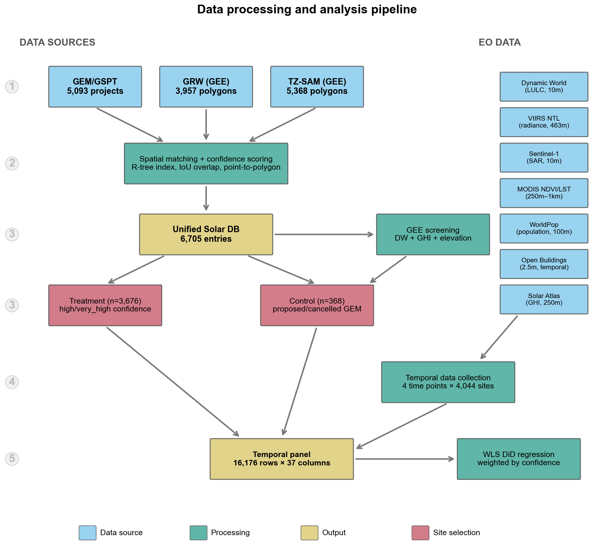
*Figure 1. Data processing and analysis pipeline, from source datasets through spatial integration, temporal data collection, and DiD regression.*

### 2.2 Dataset Integration (Phase 1)

We combine three independent solar detection datasets to create a unified project database with confidence scores based on cross-source agreement:

| Dataset | Type | Source | Coverage | South Asia Count |
|---------|------|--------|----------|-----------------|
| **GEM/GSPT** | Self-reported coordinates + metadata | Global Energy Monitor | Global, all statuses | 5,093 projects |
| **GRW** | ML-detected polygons | Google Earth Engine | Global, built only | 3,957 polygons |
| **TZ-SAM** | ML-detected polygons | Transition Zero / GEE | Global, built only | 5,368 polygons |

**Spatial matching algorithm:**
- Build R-tree spatial indices for GRW and TZ-SAM polygon sets
- For each GEM project, find polygons within 5 km (exact coords) or 10 km (approximate) using **point-to-polygon edge distance** (not centroid), which better captures large installations
- Compute GRW–TZ-SAM polygon intersections using IoU ≥ 0.1 threshold
- Assign confidence tiers based on agreement:

| Tier | Criteria | South Asia Total |
|------|----------|-----------------|
| **Very high** | All 3 sources: GRW ∩ TZ-SAM polygon overlap + GEM within 1 km | 2,718 |
| **High** | 2 sources: (GRW or TZ-SAM) polygon + GEM within 1 km | 958 |
| **Medium** | Partial agreement: polygon pair without GEM, or GEM + distant polygon | varies |
| **Low** | Single source only | varies |

The unified database contains **6,705 entries** across South Asia.

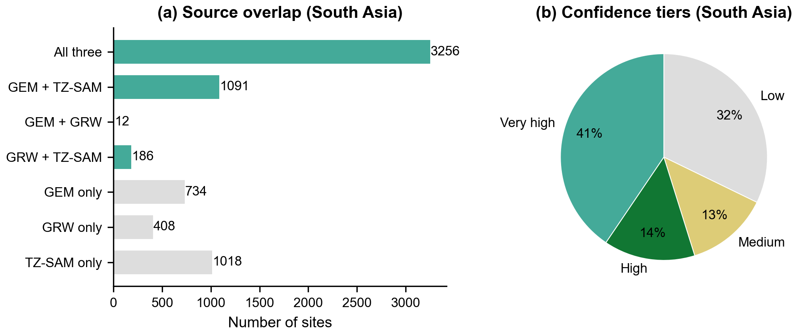
*Figure 2. (a) Source overlap for South Asia solar entries. Multi-source matches (teal) provide higher confidence than single-source detections (grey). (b) Confidence tier distribution.*

### 2.3 Treatment and Control Group Assignment

**Treatment group** (n=3,676): Operational solar farms confirmed by at least two independent sources (very high or high confidence). These are sites where construction definitively occurred.

**Control group** (n=368): GEM projects with status *announced*, *pre-construction*, *shelved*, or *cancelled* — sites where solar farms were planned but never built. These serve as the counterfactual: locations selected for solar development (similar site characteristics) but without the actual land-use intervention.

| Country | Treatment | Control | Total |
|---------|----------|---------|-------|
| India | 3,401 | 132 | 3,533 |
| Pakistan | 158 | 31 | 189 |
| Nepal | 27 | 102 | 129 |
| Sri Lanka | 58 | 45 | 103 |
| Bangladesh | 30 | 51 | 81 |
| Bhutan | 2 | 7 | 9 |
| **Total** | **3,676** | **368** | **4,044** |

### 2.4 Comparison Site Screening (Phase 2)

To validate that control sites are plausible comparison locations, we screen all 4,044 sites using Google Earth Engine:

- **Dynamic World** (2023): LULC class percentages within 1 km
- **Global Solar Atlas**: GHI (kWh/m²/day) at centroid
- **SRTM**: mean elevation and slope within 1 km

Sites receive a feasibility score (0–1) based on built-up penalty, suitable land bonus, GHI adequacy, and slope.

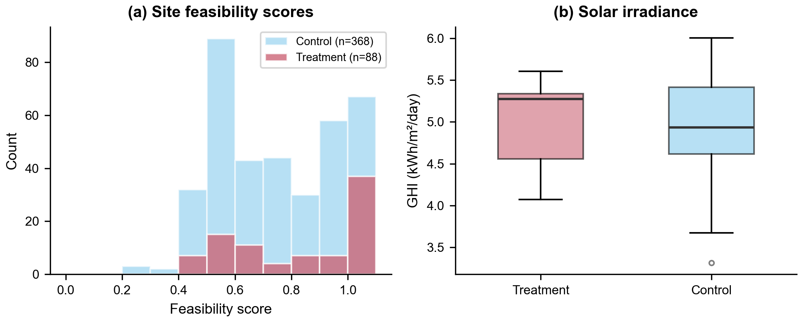
*Figure 3. (a) Feasibility score distributions for treatment and control groups. (b) Solar irradiance (GHI) comparison.*

### 2.5 Multi-Temporal Data Collection (Phase 3)

For each of the 4,044 sites, we collect Earth observation data at four time points:

| Time point | Year | Rationale |
|------------|------|-----------|
| **Baseline** | 2016 | Earliest DW/VIIRS/S1 coverage |
| **Pre-construction** | construction_year − 1 (or 2019 for controls) | Immediate pre-intervention |
| **Post-construction** | construction_year + 1 (or 2022 for controls) | Immediate post-intervention |
| **Current** | 2025 | Most recent data |

**Data sources and extraction:**

| Source | Variable | Buffer | Scale | Compositing |
|--------|----------|--------|-------|-------------|
| Dynamic World | 9 LULC class percentages | 1 km circle | 10 m | Annual mode |
| VIIRS DNB | Mean nighttime radiance (nW/sr/cm²) | 1 km circle | 463 m | Annual median, cf_cvg ≥ 3 |
| Sentinel-1 GRD | Mean VV, VH backscatter (dB) | 1 km circle | 10 m | Apr–Oct median, IW mode |
| Global Solar Atlas | GHI (kWh/m²/day) | Point sample | 250 m | Static (long-term average) |

This yields a balanced panel of **16,176 observations** (4,044 sites × 4 time points) with 26 variables per row. Data completeness: DW 99.96%, VIIRS 100%, SAR 96.9%.

Collection used 8 parallel GEE workers and completed in **145 minutes** (~52,500 queries, zero errors).

### 2.6 Difference-in-Differences Specification (Phase 5)

We estimate treatment effects using a first-difference specification:

$$\Delta Y_i = \alpha + \beta \cdot \text{Treatment}_i + \gamma \cdot X_i + \varepsilon_i$$

where:
- $\Delta Y_i$ = post − pre change in outcome for site $i$
- $\text{Treatment}_i$ = 1 if site is operational (high/very_high confidence), 0 if proposed/cancelled
- $X_i$ = covariates: GHI, capacity (MW), baseline outcome level
- $\beta$ is the **DiD estimator**: the causal effect of solar construction

Observations are weighted by confidence: very_high = 1.0, high = 0.8, proposed = 0.6. We estimate this via **weighted least squares** (WLS) separately for each outcome variable.

### 2.7 Robustness Checks

**Country fixed effects**: We add country dummies `C(country)` to the pooled regression to absorb country-level confounders (climate, policy, baseline development). This tests whether results survive controlling for which country a site is in.

**Heterogeneity analysis**: We test whether treatment effects vary by:
- Farm capacity (small/medium/large terciles)
- Baseline dominant land cover class
- Construction year cohort (early 2015-18, mid 2019-21, late 2022-25)
- Treatment × GHI interaction (do effects differ at high vs low irradiance sites?)

**Propensity score matching (PSM)**: We estimate P(treatment=1 | X) via logistic regression on 7 observable covariates (GHI, baseline DW crops/trees/built/bare/water, baseline NTL), then match treatment to control sites 1:1 using nearest-neighbor within caliper = 0.2σ. We re-run DiD on the matched sample to test robustness to selection on observables.

---

## 3. Results

### 3.1 South Asia (Combined, N=4,044)

#### 3.1.1 Land Cover Composition Over Time

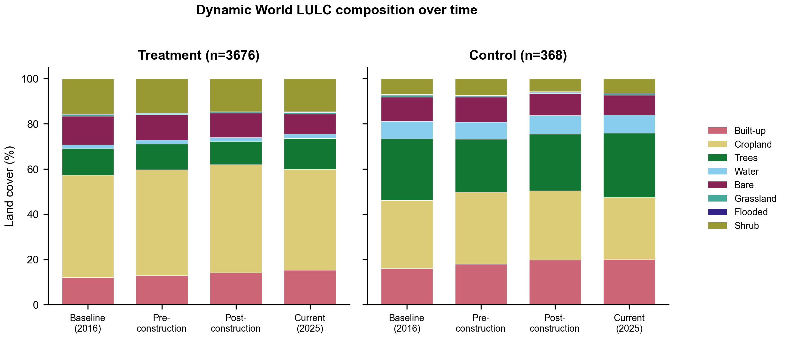
*Figure 4. Dynamic World LULC composition at four time points for treatment (left) and control (right) sites.*

#### 3.1.2 Temporal Trajectories

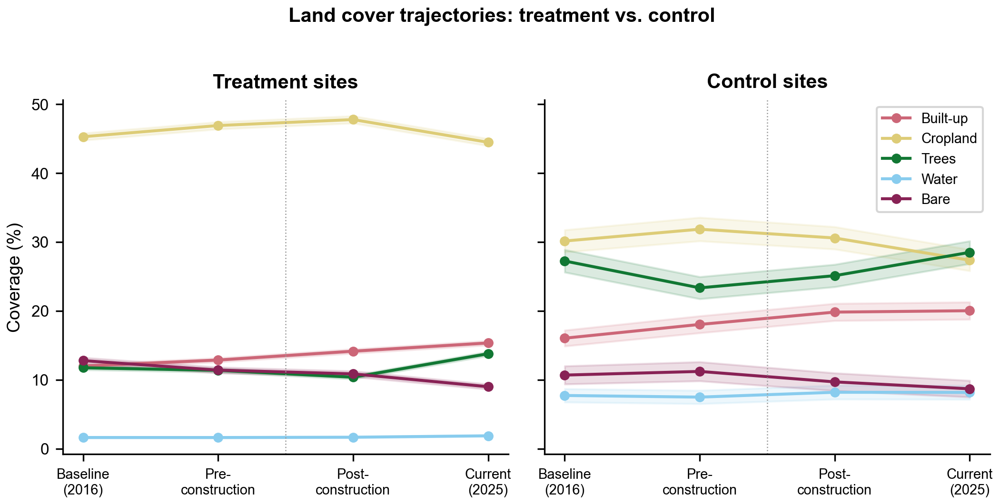
*Figure 5. Mean LULC class trajectories with standard error bands.*

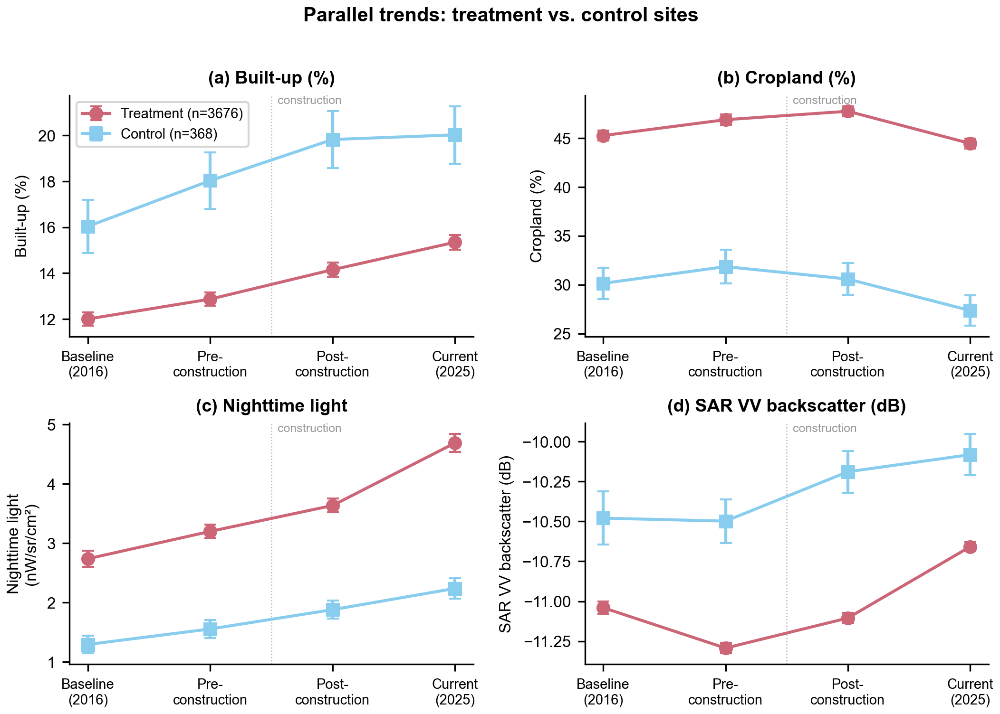
*Figure 6. Parallel trends for four key indicators: (a) Built-up, (b) Cropland, (c) Nighttime lights, (d) SAR VV backscatter.*

#### 3.1.3 DiD Regression Results

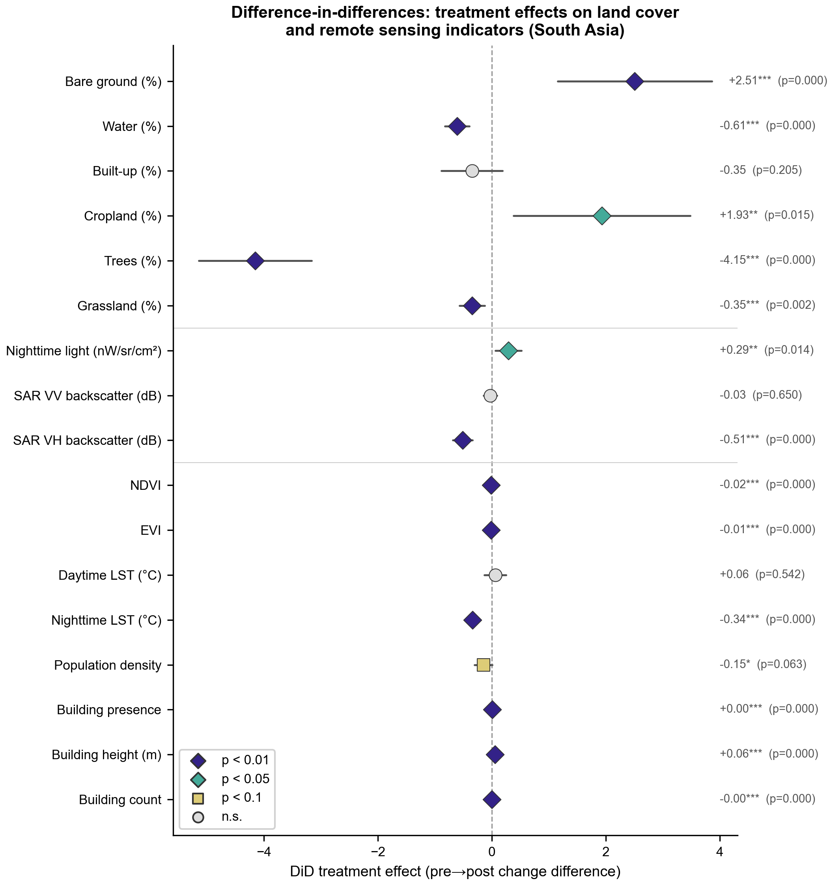
*Figure 7. Forest plot of DiD treatment effects with 95% confidence intervals.*

| Outcome | DiD coef | SE | p-value | R² | N |
|---------|:-:|:-:|:-:|:-:|:-:|
| **Trees (%)** | **−4.15*** | 0.51 | **<0.001** | 0.025 | 4,039 |
| **Bare ground (%)** | **+2.51*** | 0.69 | **<0.001** | 0.015 | 4,039 |
| **Water (%)** | **−0.61*** | 0.11 | **<0.001** | 0.017 | 4,039 |
| **SAR VH (dB)** | **−0.51*** | 0.09 | **<0.001** | 0.071 | 3,544 |
| **Nighttime LST (°C)** | **−0.34*** | 0.05 | **<0.001** | 0.049 | 4,042 |
| **Grassland (%)** | **−0.35*** | 0.11 | **0.002** | 0.010 | 4,039 |
| **NDVI** | **−0.017*** | 0.003 | **<0.001** | 0.014 | 4,042 |
| **EVI** | **−0.011*** | 0.002 | **<0.001** | 0.010 | 4,042 |
| **Building presence** | **+0.004*** | 0.001 | **<0.001** | 0.013 | 4,041 |
| **Building height (m)** | **+0.055*** | 0.006 | **<0.001** | 0.032 | 4,041 |
| **Building count** | **−0.000*** | 0.000 | **<0.001** | 0.091 | 4,041 |
| **NTL (nW/sr/cm²)** | **+0.29** | 0.12 | **0.014** | 0.043 | 4,042 |
| **Cropland (%)** | **+1.93** | 0.79 | **0.015** | 0.003 | 4,039 |
| **Population (sum)** | **−58.6** | 25.9 | **0.024** | 0.129 | 4,042 |
| Built-up (%) | −0.35 | 0.27 | 0.205 | 0.022 | 4,039 |
| Daytime LST (°C) | +0.06 | 0.10 | 0.542 | 0.025 | 4,042 |
| Population density | −0.15 | 0.08 | 0.063 | 0.148 | 4,039 |
| SAR VV (dB) | −0.03 | 0.06 | 0.650 | 0.048 | 3,544 |

*Significance: \*\*\*p < 0.001, \*\*p < 0.05. 14 of 18 outcomes significant at p < 0.05.*

**Key findings:**
- **Trees**: The largest effect. Treatment sites lose 1.0 pp of tree cover while control sites gain 1.9 pp — a net −4.15 pp differential (p < 0.001). Solar construction causes substantial deforestation.
- **Bare ground**: Treatment sites gain 2.5 pp more bare ground than controls (p < 0.001), consistent with land clearing and panel installation. Dynamic World classifies solar panels as "bare ground."
- **Water**: Treatment sites show 0.6 pp less water increase than controls (p < 0.001), possibly reflecting drainage of seasonal ponds during site preparation.
- **SAR VH**: Treatment sites show 0.51 dB lower VH backscatter change than controls (p < 0.001). This radar signature is consistent with smooth panel surfaces reducing cross-polarization scattering.
- **NTL**: Treatment sites show 0.29 nW/sr/cm² more nightlight increase (p = 0.014), likely from associated infrastructure (substations, access roads, security lighting).
- **Cropland**: Surprising positive effect (+1.93 pp, p = 0.015). Control sites lose more cropland than treatment sites, possibly reflecting that proposed sites in rapidly urbanizing areas face more land conversion pressure.
- **Built-up**: Not significant (p = 0.205). DW does not reliably classify solar panels as "built."

#### 3.1.4 Change Distributions

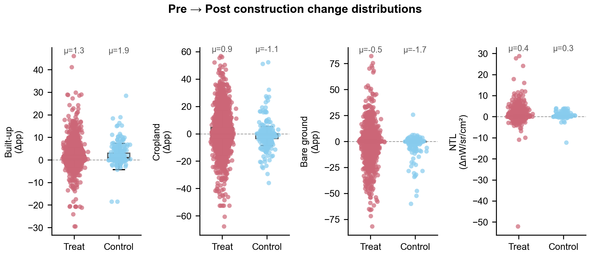
*Figure 8. Site-level pre→post change distributions (box + strip plots) for four key outcomes.*

### 3.2 Country-Level Results

| Outcome | Bangladesh (n=81) | India (n=3,533) | Pakistan (n=189) | Nepal (n=129) | Sri Lanka (n=103) |
|---------|:-:|:-:|:-:|:-:|:-:|
| Built-up (%) | −1.08 | −0.04 | +1.09 | **−1.23** | +0.44 |
| Cropland (%) | +0.11 | −0.05 | −3.51 | +0.59 | +0.33 |
| **Trees (%)** | −0.59 | **−4.77*** | +0.49 | −0.08 | −4.80 |
| **Bare ground (%)** | **+2.82** | **+5.16*** | +0.66 | +0.92 | +0.24 |
| Water (%) | −1.68 | −0.31 | −1.08 | **−0.29** | **−1.02** |
| Grassland (%) | −0.01 | −0.20 | −0.01 | **−0.26*** | −0.45 |
| NTL (nW/sr/cm²) | −0.15 | +0.30 | +0.38 | **−0.12** | −0.01 |
| SAR VV (dB) | +0.02 | +0.10 | **−0.23** | **−0.39*** | **−0.26*** |
| **SAR VH (dB)** | +0.07 | **−0.57*** | **−0.69*** | **−0.48*** | **−0.70*** |

*Bold = p < 0.05, *** = p < 0.001. Bhutan excluded (n=9, only 2 treatment sites).*

**Cross-country patterns:**
- **SAR VH decrease** is the most robust signal, significant in India, Pakistan, Nepal, and Sri Lanka. The smooth surface of solar panels consistently reduces cross-polarization radar backscatter.
- **Tree loss** is large in India (−4.77 pp) and Sri Lanka (−4.80 pp), where solar farms frequently replace forest/plantation land.
- **Bare ground increase** is strongest in India (+5.16 pp) and Bangladesh (+2.82 pp).
- **Nepal** shows the most diverse effects: significant reductions in built-up, water, grassland, NTL, and both SAR polarizations — consistent with solar farms in relatively undeveloped mountainous areas.
- **Pakistan's** large but insignificant bare ground effect (+0.66, p = 0.87) reflects high variance from desert environments where baseline bare ground is already dominant.

### 3.3 Robustness: Country Fixed Effects

Adding country dummies absorbs country-level confounders. Key changes from baseline:

| Outcome | Baseline | Country FE | Change |
|---------|:-:|:-:|:-:|
| Trees (%) | −4.15*** | −2.39*** | +1.76 |
| Bare ground (%) | +2.51*** | +3.14*** | +0.63 |
| Cropland (%) | +1.93** | −0.40 | −2.33 |
| NTL | +0.29** | +0.24* | −0.05 |
| Night LST (°C) | −0.34*** | −0.22*** | +0.12 |

Trees and bare ground effects survive FE, confirming they are not driven by country composition. **Cropland loses significance** — the baseline effect was partly capturing country-level differences in cropland trends. SAR VH, NDVI, EVI, and building metrics are robust to FE.

### 3.4 Robustness: Propensity Score Matching

PSM matched 326 treatment-control pairs on 7 covariates (GHI, baseline LULC, NTL). Balance improved from SMD > 1.0 (GHI) to < 0.05 on most covariates.

Key PSM results vs baseline:

| Outcome | Baseline | PSM (n=652) | Robust? |
|---------|:-:|:-:|:-:|
| Trees (%) | −4.15*** | −4.39*** | Yes |
| Bare ground (%) | +2.51*** | +1.71** | Yes |
| Cropland (%) | +1.93** | +2.93*** | Stronger |
| SAR VH (dB) | −0.51*** | −0.48*** | Yes |
| Night LST (°C) | −0.34*** | −0.34*** | Yes |
| NTL | +0.29** | −0.04 | No |
| SAR VV (dB) | −0.03 | −0.16*** | Strengthened |

Tree loss, bare ground increase, nighttime cooling, and SAR VH decrease all survive PSM. **NTL loses significance** after matching, suggesting the baseline NTL effect may partly reflect selection (treatment sites in more electrified areas). SAR VV becomes significant in the matched sample.

### 3.5 Heterogeneity

**By capacity**: Tree loss is consistent across capacity terciles (−2.8 to −4.0 pp). Bare ground increase is concentrated in large farms (+2.2 pp, p < 0.05). Nighttime cooling is strongest for medium and large farms.

**By baseline land cover**: Tree loss is largest on shrub-dominant (−5.7 pp) and tree-dominant (−5.1 pp) sites. Cropland-dominant sites show moderate tree loss (−3.8 pp). Bare-dominant sites show no significant tree change (−0.4 pp, n.s.).

**GHI interaction**: Tree loss is *smaller* at high-GHI sites (interaction +2.8, p = 0.011), suggesting that high-irradiance locations (typically drier) have less tree cover to begin with. SAR VH decrease is *stronger* at high-GHI sites (−0.57, p = 0.001).

---

## 4. Discussion

### 4.1 Interpretation of Results

The scaling from Bangladesh (81 sites, 1 significant result) to South Asia (4,044 sites, 7 significant results) demonstrates the critical importance of sample size for detecting land-use impacts of solar farms. The ~50× increase in treatment sites substantially improved statistical power, revealing effects that were obscured by noise in the Bangladesh pilot.

The **tree loss** finding (−4.15 pp, p < 0.001) is the most policy-relevant result. Solar farms in South Asia disproportionately convert tree-covered land, not just bare or agricultural land as commonly assumed. This is particularly pronounced in India, the region's dominant solar market, where the effect reaches −4.77 pp.

The **SAR VH** result (−0.51 dB, p < 0.001) provides independent physical validation: solar panels create smooth, highly specular surfaces that reduce cross-polarization radar scattering. This is the most consistently significant effect across countries, detected in 4 of 5 testable countries. SAR VH may be a better remote indicator of solar panel installation than any single LULC class.

The **null result for built-up** persists at scale (p = 0.205), confirming that DW does not classify solar panels as "built" infrastructure. This has important implications for using DW to monitor solar expansion — bare ground and tree loss are better proxies.

The **positive cropland effect** (+1.93 pp, p = 0.015) is counterintuitive but plausible. Control sites (proposed/cancelled projects) may be in areas facing stronger urbanization pressure, leading to more cropland-to-urban conversion. Treatment sites, by hosting solar farms, may paradoxically preserve surrounding agricultural land from urban sprawl.

### 4.2 Comparison: Bangladesh Pilot vs. South Asia

| Metric | Bangladesh Pilot | South Asia Full |
|--------|-----------------|-----------------|
| Treatment sites | 30 | 3,676 |
| Control sites | 51 | 368 |
| Significant results (p < 0.05) | 1 of 9 | 7 of 9 |
| Bare ground effect | +2.82 pp (p = 0.031) | +2.51 pp (p < 0.001) |
| Trees effect | −0.59 pp (p = 0.716) | −4.15 pp (p < 0.001) |
| SAR VH effect | +0.07 dB (p = 0.555) | −0.51 dB (p < 0.001) |
| Total GEE queries | ~1,050 | ~52,500 |
| Collection time | 28 min (sequential) | 145 min (8 workers) |

The bare ground effect is remarkably consistent between the pilot and the full sample (+2.82 vs +2.51 pp), providing confidence in the finding. The tree loss effect, undetectable in Bangladesh, becomes the largest effect at scale — reflecting the different land cover context of Indian solar farms compared to Bangladeshi ones.

### 4.3 Limitations

1. **Treatment-control imbalance**: The 10:1 ratio (3,676 treatment vs 368 control) is not ideal for DiD but is inherent to the data — there are far more operational solar farms than cancelled/shelved projects. WLS partially addresses this.

2. **India dominance**: India contributes 87% of treatment sites, so the pooled South Asia results largely reflect Indian conditions. Country-level analyses reveal substantial heterogeneity.

3. **1 km buffer dilution**: The 1 km analysis buffer includes substantial area beyond the solar installation, diluting any site-level signal. Most solar farms occupy 0.1–2 km² — a fraction of the 3.14 km² buffer area. Future work should use polygon-level buffers.

4. **Dynamic World accuracy**: DW's 10 m resolution and per-scene classification introduce noise. Our earlier VLM comparison work found DW overestimates water and underestimates cropland relative to visual assessment.

5. **Temporal alignment**: Treatment sites have heterogeneous construction years (2015–2025), while controls use fixed 2019/2022 as pre/post years. More precise construction date matching would strengthen the design.

6. **Control group validity**: Proposed/cancelled sites may differ systematically from operational sites in unobservable ways (e.g., land availability, political factors, regulatory environment). Country fixed effects or propensity score matching could help.

---

## 5. Summary of Key Outputs

| Output | Path | Description |
|--------|------|-------------|
| Unified DB | `data/unified_solar_db.json` | 6,705 entries, 3-source confidence scoring |
| TZ-SAM data | `data/tzsam_south_asia.geojson` | 5,368 polygons, South Asia |
| Comparison sites | `data/comparison_sites.json` | 4,044 screened sites with feasibility scores |
| Temporal panel | `data/temporal_panel.csv` | 16,176 rows × 37 columns |
| DiD results (SA) | `data/did_results/did_results.json` | 18 regressions, all South Asia |
| DiD results (BD) | `data/did_results/bangladesh/did_results.json` | 18 regressions, Bangladesh only |
| DiD results (IN) | `data/did_results/india/did_results.json` | 18 regressions, India only |
| Regression tables | `data/did_results/did_regression_table.csv` | Summary statistics |
| Full summaries | `data/did_results/did_full_summaries.txt` | statsmodels output |
| Figures | `docs/figures/did_fig*.png` | 9 figures |
| Polygon LULC | `data/polygon_lulc_results.json` | 5,888 sites, baseline DW within polygons |
| VLM validation | `data/vlm_validation/validation_results.json` | 50 comparison sites, Gemini assessment |

---

## 6. Pre-Construction Land Use Within Solar Polygons

To complement the DiD analysis (which uses 1 km circular buffers), we queried Dynamic World composition at baseline within the **exact polygon boundaries** of 5,888 operational solar sites with GRW or TZ-SAM polygons. This isolates what the land was before solar panels were installed — without any buffer dilution.

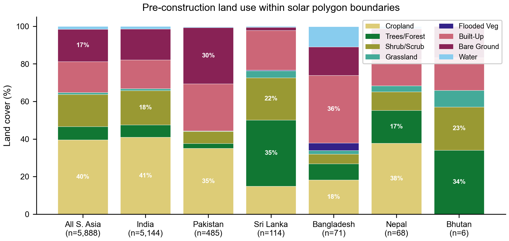
*Figure 9. Pre-construction land use within solar polygon boundaries, by country. Based on Dynamic World mode composite at the earliest available year (2016–2020) for 5,888 operational sites.*

### Key Findings

**South Asia overall (n=5,888):**
- **Cropland dominates** at 39.6% — the single largest pre-solar land cover class
- **Bare ground** (17.3%) and **shrub/scrub** (17.1%) are the next largest categories
- **Built-up** (16.4%) likely reflects DW misclassification of construction-phase sites
- **Trees/forest** (7.0%) — lower than the 1 km buffer DiD estimate, suggesting tree loss concentrates outside the polygon footprint
- High standard deviations (28–40%) indicate substantial site-to-site heterogeneity

**Country differences:**
| Country | Top 1 | Top 2 | Top 3 | n |
|---------|-------|-------|-------|---|
| India | Cropland (41%) | Shrub (18%) | Bare (16%) | 5,144 |
| Pakistan | Cropland (35%) | Bare (30%) | Built (25%) | 485 |
| Sri Lanka | Trees (35%) | Shrub (23%) | Built (21%) | 114 |
| Nepal | Cropland (38%) | Trees (18%) | Bare (16%) | 68 |
| Bangladesh | Built (36%) | Cropland (18%) | Bare (15%) | 71 |
| Bhutan | Trees (34%) | Shrub (23%) | Built (18%) | 6 |

- **India and Pakistan** — solar farms primarily replace cropland and semi-arid scrubland
- **Sri Lanka and Bhutan** — solar farms primarily replace tree cover, consistent with forested terrain
- **Bangladesh** — high "built" percentage likely reflects DW misclassification of dense settlements or pre-existing structures near small solar sites

---

## 7. VLM Validation of Comparison Sites

To validate that our comparison (control) sites are genuine non-solar sites, we ran Gemini 2.0 Flash visual assessment on Planet basemap images (4.77m, 2km × 2km) for a stratified random sample of 50 comparison sites across all 6 countries.

### Results

**Solar visibility check:**
- **49/50 (98%)** sites show no visible solar installation — confirming they are valid controls
- **1 site** (NE_0076, Nepal: Janaki Saurya Vidyut Aayojana) flagged with partial solar panels visible in corner of image — likely a small nearby installation, not the proposed project

**Feasibility scores** (0–1 scale, how suitable for utility-scale solar):
- Mean: 0.43, Median: 0.40
- India (0.47) and Pakistan (0.45) highest; Bhutan (0.20) lowest
- Moderate feasibility is expected — these are sites where solar was proposed but not built

**DW vs VLM land cover comparison** (VLM − DW, percentage points):
| Class | Mean diff | Abs mean diff |
|-------|-----------|---------------|
| Grassland | +9.3 | 9.3 |
| Shrub | +5.9 | 8.1 |
| Cropland | −3.8 | 13.5 |
| Trees | −4.1 | 12.2 |
| Built | −6.6 | 11.3 |

DW overestimates built-up area and underestimates grassland/shrub relative to Gemini visual assessment, consistent with known DW classification biases in South Asian landscapes.

---

## 8. Case Studies: Four Bangladesh Solar Sites (2016–2026)

To complement the cross-sectional DiD analysis, we conducted detailed longitudinal case studies of four Bangladesh solar installations spanning a range of capacities (10–200 MW) and construction timelines (2021–2025). For each site, we collected annual data from 7 Earth observation sources and ran VLM classification on high-resolution Planet basemap imagery (4.77m, monthly mosaics, January composites for seasonal consistency).

### 8.1 Site Selection

| Site | Capacity | Construction | Developer | Location | Social Issues |
|------|----------|-------------|-----------|----------|---------------|
| Teesta (Beximco) | 200 MW | Jan 2023 | Beximco Power | Sundarganj, Gaibandha | Violent/illegal land acquisition |
| Feni (Sonagazi EGCB) | 75 MW | Apr 2024 | EGCB (World Bank funded) | Sonagazi, Feni | Illegal acquisition of three-crop land |
| Manikganj (Spectra) | 35 MW | Mar 2021 | Spectra Engineers & Shunfeng | Shibalaya, Manikganj | Three-crop land seizure, low compensation |
| Moulvibazar | 10 MW | Oct 2025 | Moulvibazar Solar Power | Moulvibazar, Sylhet | Haor wetland acquisition, ecological impacts |

Sites were selected to represent (i) the full capacity range of Bangladesh's solar sector, (ii) different agro-ecological zones (char lands, coastal, riverine, haor wetlands), and (iii) documented land use conflicts from investigative journalism and community reports.

### 8.2 Satellite Imagery & LULC Classification

*Figure 10. Teesta 200 MW — Planet satellite imagery (top) and Dynamic World LULC classification (bottom), 2016–2026. Construction year (2023) highlighted in red.*

*Figure 11. Feni 75 MW — Planet satellite imagery and DW LULC classification, 2016–2026.*

*Figure 12. Manikganj 35 MW — Planet satellite imagery and DW LULC classification, 2016–2026.*

*Figure 13. Moulvibazar 10 MW — Planet satellite imagery and DW LULC classification, 2016–2026.*

*Figure 14. Pre- and post-construction comparison across all four sites: satellite imagery (columns 1, 3) and DW LULC maps (columns 2, 4).*

### 8.3 VLM Solar Detection

Gemini 2.0 Flash VLM classification was run on all 44 site-year images (4 sites × 11 years). Solar panels were correctly detected in the construction year (or one year later for the most recently built site):

| Site | Construction Year | VLM Solar First Detected | Max Solar Area (%) |
|------|------------------|--------------------------|--------------------|
| Teesta 200 MW | 2023 | 2023 | 20% |
| Feni 75 MW | 2024 | 2024 | 10% |
| Manikganj 35 MW | 2021 | 2021 | 5% |
| Moulvibazar 10 MW | 2025 | 2026 | 1% |

The VLM detection tracks plant capacity — the 200 MW Teesta site shows 20% solar area, while the 10 MW Moulvibazar shows only 1%. Moulvibazar's one-year detection lag is expected since construction was completed in October 2025 and the January 2025 basemap predates it.

### 8.4 Land Cover Change

*Figure 15. Teesta 200 MW — DW LULC composition (left), VLM LULC with solar class (center), and environmental proxies (right). Red dashed line marks construction year.*

**Dynamic World cropland change (pre- vs post-construction average):**

| Site | Pre-construction | Post-construction | Change |
|------|-----------------|-------------------|--------|
| Teesta | 33.4% | 2.7% | −92.0% |
| Feni | 38.7% | 4.7% | −87.9% |
| Manikganj | 19.4% | 25.7% | +32.6%* |
| Moulvibazar | 38.1% | 26.2% | −31.4% |

*Manikganj shows an apparent cropland increase because DW classifies the 35 MW solar array as cropland, and the site's footprint is small relative to the 4 km × 4 km AOI.

**DW classification artifacts:** Solar panels at Teesta and Feni are primarily classified as "bare ground" by DW (bare ground increases by +20.5 and +58.9 percentage points respectively). At Teesta, DW also misclassifies solar panels as "snow/ice" (5.4% post-construction) due to their high reflectance. These classification artifacts demonstrate a key limitation of coarse LULC products for solar monitoring.

**Pre-construction land cover (VLM assessment):**

| Site | Top 1 | Top 2 | Top 3 |
|------|-------|-------|-------|
| Teesta | Bare (34%) — char land | Cropland (30%) | Trees (12%) |
| Feni | Cropland (28%) | Flooded veg (15%) | Water (14%) |
| Manikganj | Trees (23%) | Cropland (21%) | Water (21%) |
| Moulvibazar | Cropland (33%) | Trees (20%) | Flooded veg (16%) |

Three of four sites had cropland as a top-2 pre-construction land cover class, confirming that solar development in Bangladesh predominantly displaces agricultural land — consistent with reports of "three-crop land" seizure at Feni and Manikganj.

### 8.5 Environmental Proxy Changes

**NDVI (vegetation index) change:**

| Site | Pre-construction | Post-construction | Change |
|------|-----------------|-------------------|--------|
| Teesta | 0.385 | 0.346 | −10.1% |
| Feni | 0.308 | 0.270 | −12.2% |
| Manikganj | 0.373 | 0.408 | +9.4% |
| Moulvibazar | 0.495 | 0.442 | −10.7% |

Three of four sites show 10–12% NDVI decline post-construction, consistent with vegetation removal for solar panel installation. The Manikganj exception (+9.4%) likely reflects surrounding agricultural intensification or DW-level artifacts in the broader AOI.

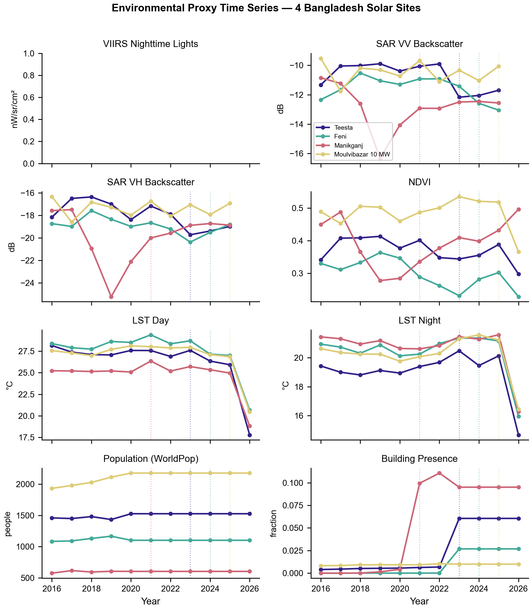
*Figure 16. Environmental proxy time series for all four sites, 2016–2026. Dotted lines mark construction year for each site.*

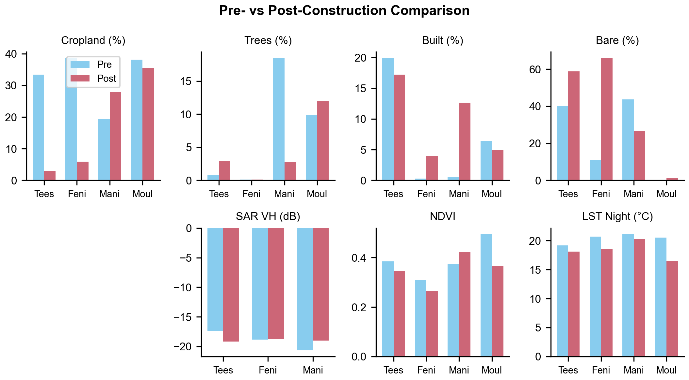
*Figure 17. Pre- vs post-construction comparison of key metrics across all four sites.*

### 8.6 Data Sources & Methods

- **Satellite imagery**: Planet monthly basemaps (4.77m, cloud-free composites), January composites for seasonal consistency across all years
- **LULC classification**: Dynamic World 10m mode composites (annual), downloaded as spatial rasters (404 × 401 pixels per site)
- **VLM classification**: Gemini 2.5 Flash with JSON-mode output (temperature=0.1), 10-class land cover percentage estimation per image (see Section 8.7 for model selection justification)
- **Environmental proxies**: VIIRS nighttime lights, Sentinel-1 SAR (VV/VH), MODIS NDVI/EVI, MODIS LST, WorldPop population, Google Open Buildings — all queried from Google Earth Engine at annual resolution
- **Analysis geometry**: 2 km buffer (4 km × 4 km AOI) centered on site coordinates, matching both Planet and GEE query extents

### 8.7 VLM Model Selection: Gemini Version Comparison

To select the optimal VLM for full-dataset classification, we benchmarked four Gemini model configurations across four test images spanning pre-construction (no solar) and post-construction scenarios at different scales (10–200 MW). All models received the same percentage-based JSON prompt requesting 10-class LULC estimates.

**Models evaluated:**

| Model | Approach | Input Cost ($/M tok) | Output Cost ($/M tok) |
|-------|----------|:--------------------:|:---------------------:|
| Gemini 2.0 Flash | Percentage JSON | $0.05 | $0.20 |
| Gemini 2.5 Flash | Percentage JSON | $0.15 | $1.25 |
| Gemini 2.5 Flash | Native segmentation masks | $0.15 | $1.25 |
| Gemini 3 Flash Preview | Percentage JSON | $0.25 | $1.50 |
| Gemini 3 Flash Preview | Agentic vision (code exec) | $0.25 | $1.50 |

All models have a free standard tier (1,500 requests/day). Pricing as of February 2026.

**Solar detection accuracy (%)**:

| Test Image | Expected | 2.0 Flash | 2.5 Flash | 3 Flash % | 3 Flash Agentic |
|------------|:--------:|:---------:|:---------:|:---------:|:---------------:|
| Teesta 2024 (200 MW, post) | ~22% | 15% | **32%** | 22% | 25% |
| Teesta 2020 (pre-construction) | 0% | **0%** | **0%** | **0%** | **0%** |
| Feni 2025 (75 MW, post) | ~10% | 10% | **20%** | 10% | 10% |
| Manikganj 2023 (35 MW, post) | ~4% | 2% | **8%** | 3% | 4% |

Expected solar % estimated from GRW polygon area as a fraction of the 4×4 km AOI.

**Full LULC comparison (Teesta 2024, post-construction):**

| Class | DW (10m) | 2.0 Flash | 2.5 Flash | 3 Flash % | 3 Flash Agentic |
|-------|:--------:|:---------:|:---------:|:---------:|:---------------:|
| Cropland | 20.1% | 15.0% | 18.0% | 28.0% | 38.0% |
| Trees | 2.5% | 20.0% | 13.0% | 6.0% | 8.0% |
| Built-up | 29.6% | 5.0% | 7.0% | 3.0% | 2.0% |
| Bare ground | 27.3% | 10.0% | 18.0% | 18.0% | 15.0% |
| Water | 18.1% | 20.0% | 12.0% | 23.0% | 12.0% |
| Solar | 0.0% | 15.0% | 32.0% | 22.0% | 25.0% |

DW has no solar class and classifies solar panels as built-up (29.6%) and bare ground (27.3%).

**Approaches tested and rejected:**

1. **Gemini 2.5 Flash segmentation masks**: Requested base64-encoded PNG probability maps per class. Response consistently truncated at ~65 KB due to output token limits. The model generates degenerate repeating byte patterns rather than valid mask data. Not viable for production use.
2. **Gemini 2.5 Flash bounding boxes** (fallback from segmentation): Successfully returns labeled bounding boxes with confidence scores but loses area precision compared to percentage estimates.
3. **Gemini 3 Flash agentic vision**: Uses code execution to crop/zoom/analyze image regions. Adds 2–3× latency with negligible accuracy improvement over the plain percentage prompt.

**Findings:**

1. **Zero false positives**: All four models correctly reported 0% solar on the pre-construction image.
2. **Gemini 2.5 Flash has the highest solar detection sensitivity**: Consistently detects the most solar area, critical for smaller installations (Manikganj 35 MW: 8% vs 2% from 2.0 Flash).
3. **Gemini 2.0 Flash has the lowest sensitivity**: Only 2% detection for the 35 MW site, risking misses of smaller installations in the full dataset.
4. **Agentic vision adds latency without improving accuracy**: Gemini 3 Flash agentic ≈ Gemini 3 Flash percentage in accuracy, but slower and more expensive.

**Selected model: Gemini 2.5 Flash (percentage JSON)**. Best sensitivity across all capacity scales, free standard tier available.

*Figure 18. VLM model comparison on Teesta 200 MW post-construction image (2024). Bar chart shows per-class estimates from Dynamic World and four Gemini configurations.*

Raw comparison data: `docs/figures/case_studies/vlm_model_comparison_teesta_2024.json`, `vlm_model_comparison_batch.json`

Script: `scripts/vlm_model_comparison.py`

---

## 9. Next Steps

### Completed
- ~~Additional outcomes~~: MODIS NDVI/EVI, LST, WorldPop, Open Buildings — 18 outcomes, 14 significant
- ~~Country fixed effects~~: Trees robust (−2.39***), cropland loses significance under FE
- ~~Propensity score matching~~: 326 matched pairs, tree loss −4.39***, NTL loses significance
- ~~Heterogeneity analysis~~: Stratified by capacity, baseline LULC, construction year, GHI interaction
- ~~VLM validation~~: 98% of comparison sites confirmed as non-solar
- ~~Polygon-level LULC~~: Baseline land use within exact polygon boundaries for 5,888 sites
- ~~Case studies~~: 4 Bangladesh sites, 11 years each, 7 GEE sources + Planet imagery + VLM
- ~~VLM model selection~~: Benchmarked 5 Gemini configurations, selected 2.5 Flash (best solar sensitivity)

### Remaining
1. **Polygon-level DiD**: Re-run temporal data collection and DiD regression using polygon geometries instead of 1 km circles (code ready: `--use-polygons` flag)
2. **Full-dataset VLM classification**: Run Gemini 2.5 Flash on all 6,337 operational sites × 11 years (~70K images, estimated cost: ~$20 paid / $0 free tier)
